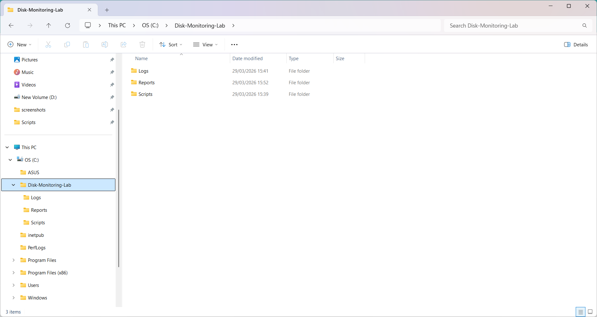
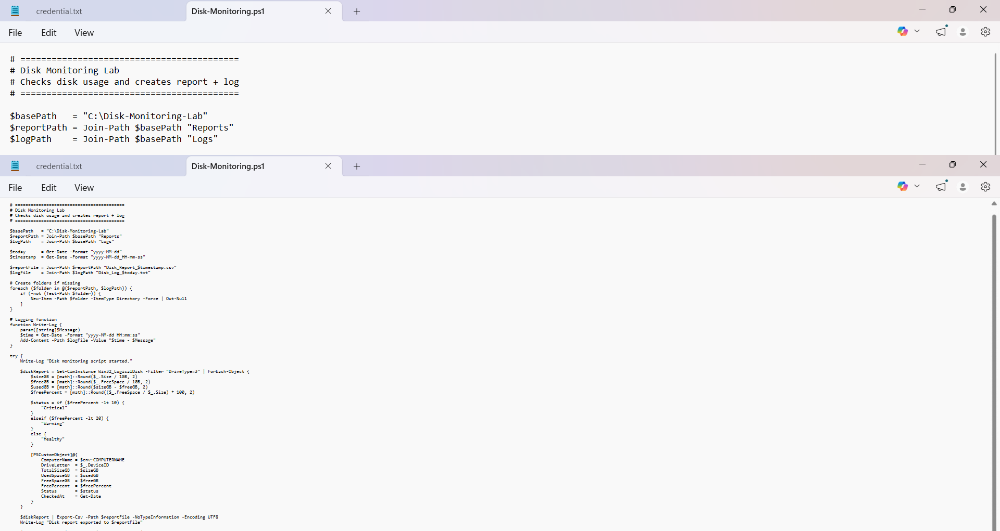
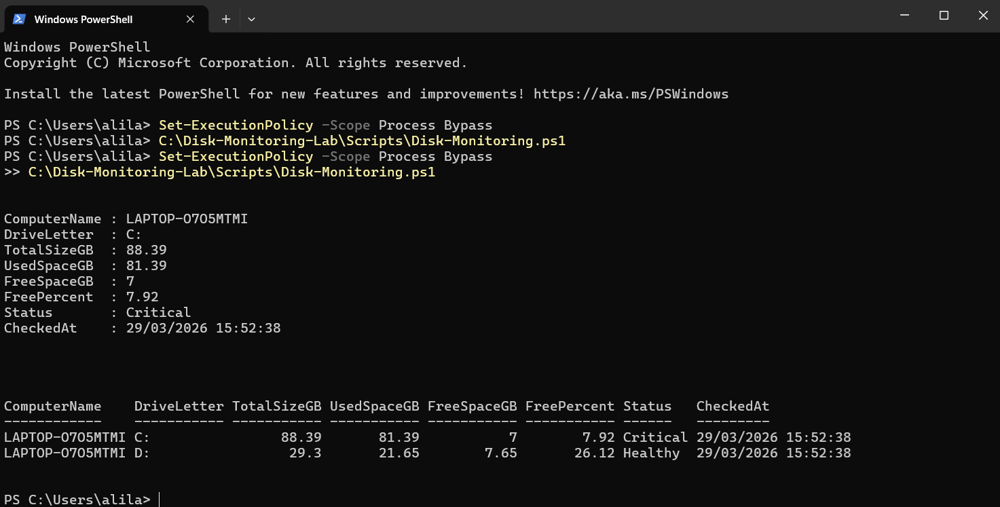
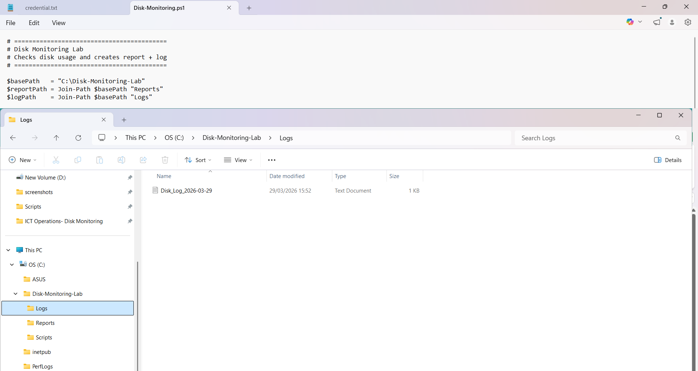
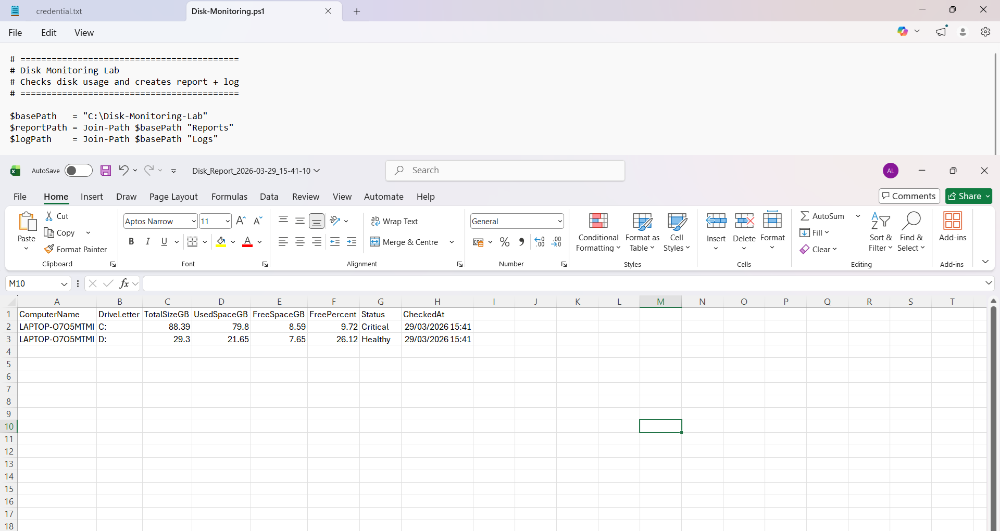

# ICT Operation - PowerShell Disk Monitoring Lab

## Overview
This project simulates a real ICT operations task using PowerShell.

The script checks local disk space, calculates free capacity, marks disks by health status, exports the results to CSV, and writes a log file for tracking.

## Objectives
- Monitor local disk usage
- Detect warning and critical disk conditions
- Export results to CSV
- Write execution logs
- Practice operational automation

## Tools Used
- PowerShell
- Windows
- CSV reporting
- Log files
- GitHub documentation

## Folder Structure
```text
powershell-disk-monitoring-lab/
├── README.md
├── scripts/
│   └── Disk-Monitoring.ps1
├── screenshots/
│   ├── 01-folder-structure.png
│   ├── 02-script-view.png
│   ├── 03-script-run.png
│   ├── 04-csv-report.png
│   └── 05-log-file.png
└── docs/
    └── notes.md
```

# Script Logic

## The PowerShell script:

Checks local disks
Calculates total, used, and free space
Calculates free percentage
Classifies disk status:
Healthy
Warning
Critical
Exports the report to CSV
Writes execution details to a log file
Sample Output

## The CSV report includes:

ComputerName
DriveLetter
TotalSizeGB
UsedSpaceGB
FreeSpaceGB
FreePercent
Status
CheckedAt

## Screenshots:

### Folder Structure


### Script View


### Script Execution


### CSV Report


### Log File



## What I Learned
How to use PowerShell for disk monitoring
How to export structured data to CSV
How to write log files
How to document a simple automation lab in GitHub

## Next Improvements
Run the script daily with Task Scheduler
Add alert logic for critical disk space
Add cleanup for old reports
